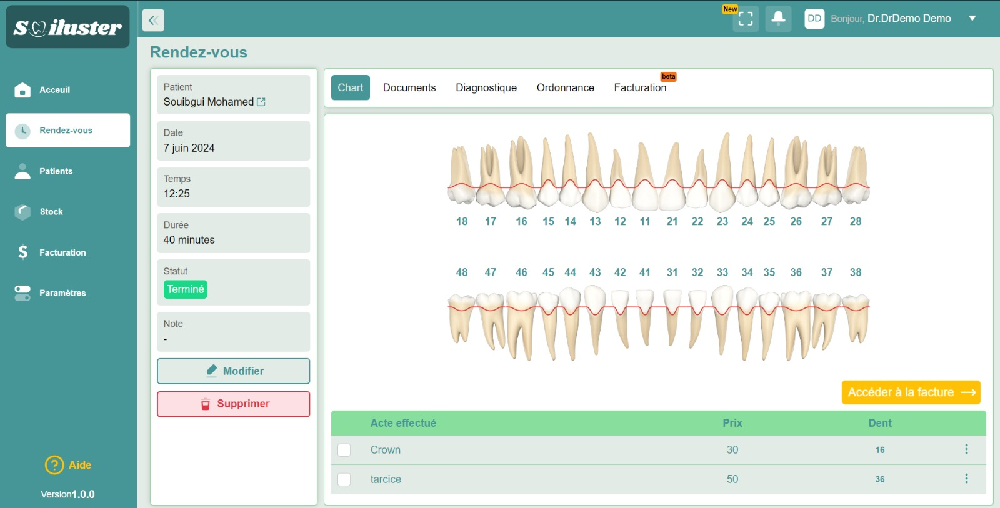

# 🦷 Smiluster - Dental Practice Management System

[](LICENSE)
[](https://www.docker.com/)
[](https://nodejs.org/)
[](https://reactjs.org/)

A comprehensive dental practice management system designed to streamline clinic operations, patient management, appointments, billing, and more.

## 🎥 Demo Video

https://github.com/yourusername/smiluster/assets/demo.mp4

> **Note:** The video file `demo.mp4` is included in the repository. You can also [download it directly](./demo.mp4) to view locally.

## ✨ Features

### 👥 Patient Management

- Complete patient records with medical history
- Document uploads and management
- Patient search and filtering
- Dental chart visualization

### 📅 Appointment Scheduling

- Interactive calendar view
- Appointment status tracking
- Automated reminders
- Conflict detection

### 💊 Treatment & Services

- Dental act catalog
- Tooth-specific treatment tracking
- Service management
- Treatment history

### 💰 Billing & Payments

- Invoice generation
- Payment tracking
- Multiple payment methods
- Financial reports

### 📊 Inventory Management

- Product catalog
- Stock tracking
- Low stock alerts
- Supplier management

### 👨‍⚕️ User & License Management

- Role-based access control
- Multi-user support
- License management
- Activity logs

## 🏗️ Architecture

```
Smiluster
├── api/              # Backend API (Node.js + Express + TypeScript)
├── front/            # Frontend Application (React + TypeScript + Vite)
└── docker-compose.yml # Docker orchestration
```

### Tech Stack

#### Backend

- **Runtime:** Node.js 18
- **Framework:** Express.js
- **Language:** TypeScript
- **Database:** MariaDB 11.2
- **ORM:** Sequelize
- **Authentication:** JWT
- **File Upload:** Multer

#### Frontend

- **Framework:** React 18
- **Language:** TypeScript
- **Build Tool:** Vite
- **State Management:** Redux Toolkit
- **Routing:** React Router v6
- **Date Handling:** Luxon
- **UI Components:** React Select, React DatePicker, SweetAlert2

## 🚀 Quick Start

### Prerequisites

- [Docker](https://docs.docker.com/get-docker/) (v20.10+)
- [Docker Compose](https://docs.docker.com/compose/install/) (v2.0+)
- [Git](https://git-scm.com/downloads)

### Installation

1. **Clone the repository**

   ```bash
   git clone https://github.com/yourusername/smiluster.git
   cd smiluster
   ```

2. **Configure environment variables**

   ```bash
   cp .env.example .env
   # Edit .env with your configuration
   nano .env
   ```

3. **Start the application with Docker**

   ```bash
   docker-compose up -d
   ```

4. **Access the application**
   - Frontend: http://localhost
   - Backend API: http://localhost:3000
   - Database: localhost:3306

5. **Login with default credentials**
   ```
   Email: admin@smiluster.com
   Password: smiluster
   ```
   
   ⚠️ **Important:** Change the default password after first login for security!

### First Time Setup

After starting the containers:

1. Wait for all services to be healthy (check with `docker-compose ps`)
2. The database will be automatically initialized with a default admin user
3. Access the frontend at http://localhost
4. Login with the default credentials:
   - **Email:** `admin@smiluster.com`
   - **Password:** `smiluster`
5. **Change your password immediately** in the profile settings

## 🐳 Docker Commands

```bash
# Start all services
docker-compose up -d

# Stop all services
docker-compose down

# View logs
docker-compose logs -f

# Rebuild and restart
docker-compose up -d --build

# Stop and remove all data (⚠️ Warning: This deletes all data)
docker-compose down -v
```

## 💻 Development Setup

If you prefer to run the application without Docker:

### Backend Setup

```bash
cd api
npm install
cp .env.example .env
# Configure your .env file
npm start
```

### Frontend Setup

```bash
cd front
npm install
npm run start
```

### Database Setup

Install MariaDB locally and create a database:

```sql
CREATE DATABASE smiluster;
CREATE USER 'smiluster_user'@'localhost' IDENTIFIED BY 'smiluster_pass';
GRANT ALL PRIVILEGES ON smiluster.* TO 'smiluster_user'@'localhost';
FLUSH PRIVILEGES;
```

## 📁 Project Structure

```
smiluster/
├── api/
│   ├── controllers/      # Request handlers
│   ├── models/          # Database models
│   ├── routes/          # API routes
│   ├── services/        # Business logic
│   ├── middlewares/     # Custom middlewares
│   ├── helpers/         # Utility functions
│   ├── enums/          # Enumerations
│   ├── public/         # Static files & uploads
│   ├── app.ts          # Application entry point
│   └── config.ts       # Configuration
│
├── front/
│   ├── src/
│   │   ├── components/  # React components
│   │   ├── pages/       # Page components
│   │   ├── redux/       # State management
│   │   ├── routers/     # Route configuration
│   │   ├── hooks/       # Custom hooks
│   │   ├── utils/       # Utility functions
│   │   └── assets/      # Images, styles, etc.
│   └── public/         # Static assets
│
└── docker-compose.yml  # Container orchestration
```

## 🔧 Configuration

### Environment Variables

Key environment variables (see `.env.example` for complete list):

| Variable            | Description       | Default           |
| ------------------- | ----------------- | ----------------- |
| `DATABASE_NAME`     | Database name     | `smiluster`       |
| `DATABASE_USERNAME` | Database user     | `smiluster_user`  |
| `DATABASE_PASSWORD` | Database password | `smiluster_pass`  |
| `TOKEN_SECRET_KEY`  | JWT secret key    | (must be changed) |
| `API_PORT`          | Backend port      | `3000`            |
| `FRONTEND_PORT`     | Frontend port     | `80`              |

### Default Credentials

The system comes with a pre-configured admin account for initial setup:

| Field    | Value                    |
| -------- | ------------------------ |
| Email    | `admin@smiluster.com`    |
| Password | `smiluster`              |
| Role     | Doctor (Admin)           |

**🔒 Security Notice:** 
- Change the default password immediately after first login
- Update `TOKEN_SECRET_KEY` in production environments
- Use strong passwords for all users
- Enable HTTPS in production deployments

## 📊 Database Schema

The application uses the following main entities:

- **Users** - System users and practitioners
- **Licenses** - Practice licenses
- **Patients** - Patient records
- **Appointments** - Appointment scheduling
- **Services** - Dental services catalog
- **Acts** - Dental procedures
- **Teeth** - Dental chart
- **Factures** - Invoices
- **Payments** - Payment records
- **Products** - Inventory items
- **Stock** - Stock management
- **Documents** - File uploads

## 🔒 Security

- JWT-based authentication
- Password hashing with bcrypt
- Role-based access control (RBAC)
- CORS protection
- Environment variable configuration
- SQL injection prevention via ORM
- XSS protection headers

## 📝 License

This project is licensed under the MIT License - see the [LICENSE](LICENSE) file for details.

## 👥 Authors

- **Your Name** - _Initial work_ - [YourGitHub](https://github.com/yourusername)

## 🙏 Acknowledgments

- Thanks to all contributors
- Dental professionals who provided valuable feedback
- Open source community

## 📞 Support

For support, email support@smiluster.com or create an issue in this repository.

## 🗺️ Roadmap

- [ ] Mobile application (React Native)
- [ ] SMS notifications
- [ ] Advanced reporting & analytics
- [ ] Multi-language support
- [ ] Cloud backup integration
- [ ] Telemedicine features
- [ ] Integration with dental imaging systems

## 📸 Screenshots

### Dental Chart Management



*Interactive dental chart with treatment tracking and visualization*

---

<p align="center">Made with ❤️ for dental professionals</p>
